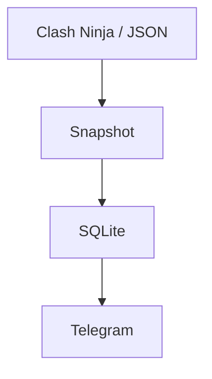

# Clash Ninja Telegram Notifier

[Русский](README.md) · [English](README_EN.md)

Telegram-бот для отслеживания улучшений Clash of Clans: таймеры по деревням и уведомления о завершении. Источник — Clash Ninja или локальный JSON-экспорт игры.

## Требования

- Windows;
- Python **3.14+**;
- аккаунт Clash Ninja с заполненным Upgrade Tracker;
- Telegram-бот от [@BotFather](https://t.me/BotFather).

Поддерживаемый launcher — [start.bat](start.bat). Если Windows Python Launcher доступен, он вызывает точный selector `py -3.14`; установленная только более новая версия Python не гарантирует успешное создание `.venv`. Другие ОС текущей версией не поддерживаются.

## Быстрый старт

1. Склонируйте репозиторий или скачайте [ZIP-архив](https://github.com/soroka01/Clash-Of-Clans-Telegram-Clash-Ninja-notifyer/archive/refs/heads/main.zip).
2. Скопируйте [config.example.json](config.example.json) в `config.json`.
3. Укажите Telegram token, разрешённые user ID и чаты для уведомлений.
4. Выберите источник данных: `"data_source": "clash_ninja"` для сайта или `"data_source": "json"` для локальных экспортов игры.
5. Запустите:

   ```powershell
   .\start.bat
   ```

6. Отправьте боту `/start`.

Launcher создаёт локальную `.venv`, обновляет в ней `pip`, `setuptools` и `wheel`, устанавливает `requirements.txt`, а затем запускает `main.py`. Глобальные Python-пакеты не используются.

Ручной запуск после подготовки окружения:

```powershell
.\.venv\Scripts\python.exe main.py
```

## Как это работает



## Команды

| Команда | Действие |
| --- | --- |
| `/start` | Открыть главное меню |
| `/menu` | Открыть главное меню |
| `/status` | Сразу открыть dashboard всех аккаунтов |

В меню доступны текущие улучшения, выбор аккаунта, настройка UTC, Clash Ninja, Clash of Clans и GitHub.

## Настройки

```json
{
  "bot_token": "PUT_TELEGRAM_BOT_TOKEN_HERE",
  "authorized_user_ids": [123456789],
  "notification_chat_ids": [123456789],
  "poll_interval_seconds": 60,
  "dashboard_refresh_seconds": 10,
  "utc_offset_hours": 5,
  "database_path": "data/clash_ninja_bot.sqlite3",
  "data_source": "json",
  "json_accounts_directory": "accounts",
  "clash_ninja": {
    "tracker_url": "https://www.clash.ninja/upgrade-tracker",
    "cookie_header": "PUT_FULL_COOKIE_HEADER_FROM_LOGGED_IN_CLASH_NINJA_HERE",
    "request_timeout_seconds": 30
  }
}
```

| Поле | Назначение |
| --- | --- |
| `bot_token` | Token Telegram-бота |
| `authorized_user_ids` | User ID, которым разрешены команды и кнопки |
| `notification_chat_ids` | Личные чаты или группы, получающие уведомления |
| `poll_interval_seconds` | Период сетевого обновления; минимум 30 секунд |
| `dashboard_refresh_seconds` | Период перерисовки countdown; минимум 10 секунд |
| `utc_offset_hours` | UTC по умолчанию, целое число от `-12` до `14` |
| `database_path` | Путь к локальной SQLite-базе |
| `data_source` | `clash_ninja` или `json` |
| `json_accounts_directory` | Папка с JSON-файлами аккаунтов |
| `clash_ninja.tracker_url` | URL Upgrade Tracker |
| `clash_ninja.cookie_header` | Полное значение HTTP-заголовка `Cookie` |
| `clash_ninja.request_timeout_seconds` | Timeout запроса; минимум 5 секунд |

> [!WARNING]
> Пустой `authorized_user_ids` означает доступ для любого Telegram-пользователя, который найдёт бота. Для приватной установки всегда указывайте хотя бы свой числовой user ID.

## Как получить Clash Ninja Cookie

1. Войдите в Clash Ninja и откройте [Upgrade Tracker](https://www.clash.ninja/upgrade-tracker).
2. Нажмите `F12`, откройте **Network** и обновите страницу.
3. Выберите успешный запрос `upgrade-tracker`.
4. Откройте **Headers** → **Request Headers**.
5. Скопируйте всё значение после `Cookie:` в одну строку.
6. Вставьте его в `clash_ninja.cookie_header`.

Cookie имеет срок действия. Если лог сообщает, что Clash Ninja отклонил сессию, войдите на сайт заново и замените значение.

## Локальные данные и безопасность

| Путь | Содержимое |
| --- | --- |
| `config.json` | Telegram token и Clash Ninja cookie; исключён из Git |
| `data/clash_ninja_bot.sqlite3` | Последний snapshot, сообщения dashboards и timezone |
| `logs/bot.log` | Подробный rotating log |
| `logs/error.log` | Только ошибки |

Не публикуйте эти файлы. Сохраняйте `config.json` и `data/`, если хотите перенести установку без потери настроек и сохранённых экранов.

## Автообновление

`start.bat` проверяет обновления перед запуском:

- в Git-клоне обновление выполняется через `git fetch` и `git pull --ff-only`;
- наличие любых записей в `git status --porcelain`, включая untracked-файлы, пропускает update;
- без Git или в распакованном ZIP launcher скачивает свежий архив через PowerShell;
- при ошибке сети запускается уже установленная версия.

В обоих режимах сохраняются `config.json`, `.venv`, `data/` и `logs/`. ZIP-режим может заменить остальные файлы проекта, поэтому не храните в его каталоге несохранённые изменения исходников.

## Ограничения

- Парсер зависит от текущей HTML/feed-структуры Clash Ninja и может потребовать обновления после изменений сайта.

## Решение проблем

| Симптом | Что проверить |
| --- | --- |
| Clash Ninja отклонил сессию | Получите новый `cookie_header` |
| Бот игнорирует команды | `bot_token` и свой ID в `authorized_user_ids` |
| Нет уведомлений | `notification_chat_ids`, права бота и `logs/error.log` |
| Dashboard показывает старые данные | Доступность Clash Ninja и `poll_interval_seconds` |
| Update пропущен | `git status --short`, включая untracked-файлы |
| Не создаётся `.venv` | Наличие именно Python 3.14 для `py -3.14` |

## Режим без Clash Ninja

Можно получать данные напрямую из JSON-экспорта игры. Укажите в `config.json`:

```json
{
  "data_source": "json",
  "json_accounts_directory": "accounts"
}
```

Положите исходный JSON каждой деревни отдельным файлом в папку `accounts/`. Ничего добавлять в JSON не нужно: ником считается имя файла без `.json`, например `accounts/Greatness.json`. Builder Base (`buildings2`, `units2` и другие поля с суффиксом `2`) не учитывается.

В этом режиме cookie и доступ к сайту не нужны. При замене JSON-файла бот обнаружит завершение активного таймера на следующем цикле опроса.

## Лицензия

[MIT](LICENSE).

## Поддержка

Можно [форкнуть репозиторий](https://github.com/soroka01/Clash-Of-Clans-Telegram-Clash-Ninja-notifyer/fork) и доработать под себя. Если проект пригодился, поставьте [Star](https://github.com/soroka01/Clash-Of-Clans-Telegram-Clash-Ninja-notifyer) — так я увижу, что он был кому-то полезен.

---

with love ❤️
