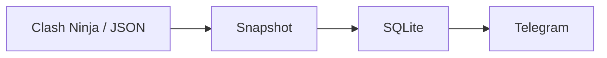

# ⚔️ Clash Ninja Telegram Notifier

> Telegram-бот для отслеживания улучшений Clash of Clans: таймеры по деревням и уведомления о завершении.

🌐 **Язык / Language:** [Русский](README.md) · [English](README_EN.md)


## 📌 Обзор

Бот следит за таймерами улучшений нескольких аккаунтов (деревень) Clash of Clans, показывает их в Telegram-dashboard с обновляемым countdown и присылает уведомление, когда улучшение завершено. Источник данных — Clash Ninja Upgrade Tracker или локальные JSON-экспорты игры.

> [!WARNING]
> Пустой `authorized_user_ids` означает доступ для любого Telegram-пользователя, который найдёт бота. Для приватной установки всегда указывайте хотя бы свой числовой user ID.

> [!NOTE]
> Поддерживается только Windows и запуск через [start.bat](start.bat). Builder Base не учитывается.

## ✨ Возможности

- Таймеры улучшений по деревням и dashboard всех аккаунтов с обновляемым countdown.
- Уведомления о завершении в личные чаты или группы.
- Два источника данных: Clash Ninja (cookie) или локальные JSON-экспорты игры.
- Настройка часового пояса (UTC) через меню бота.
- Состояние (snapshot, сообщения dashboards, timezone) хранится в локальной SQLite.
- `start.bat` сам создаёт `.venv`, ставит зависимости и проверяет обновления.

## 🏗️ Как это работает


```mermaid
flowchart LR
    A["Clash Ninja / JSON"] --> B["Snapshot"]
    B --> C["SQLite"]
    C --> D["Telegram"]
```

Бот периодически (`poll_interval_seconds`) получает данные и сохраняет snapshot; countdown в dashboard перерисовывается с периодом `dashboard_refresh_seconds`.

## 🚀 Быстрый старт

### Требования

- Windows;
- Python **3.14+** (при наличии Windows Python Launcher `start.bat` вызывает `py -3.14`; одной лишь более новой версии для создания `.venv` недостаточно);
- Telegram-бот от [@BotFather](https://t.me/BotFather);
- для источника Clash Ninja: аккаунт с заполненным Upgrade Tracker.

### Установка

```powershell
git clone https://github.com/soroka01/Clash-Of-Clans-Telegram-Clash-Ninja-notifyer.git
cd Clash-Of-Clans-Telegram-Clash-Ninja-notifyer
```

Либо скачайте [ZIP-архив](https://github.com/soroka01/Clash-Of-Clans-Telegram-Clash-Ninja-notifyer/archive/refs/heads/main.zip).

### Настройка

```powershell
Copy-Item config.example.json config.json
```

Укажите в `config.json` Telegram token, разрешённые user ID, чаты для уведомлений и `data_source` (`clash_ninja` или `json`). Все поля описаны ниже.

### Запуск

```powershell
.\start.bat
```

Затем отправьте боту `/start`. Launcher создаёт локальную `.venv`, обновляет в ней `pip`, `setuptools` и `wheel`, ставит `requirements.txt` и запускает `main.py`; глобальные пакеты не используются. Ручной запуск после подготовки окружения:

```powershell
.\.venv\Scripts\python.exe main.py
```

## ⚙️ Конфигурация

Настройки читаются из `config.json` (шаблон — [config.example.json](config.example.json)).

```json
{
  "bot_token": "PUT_TELEGRAM_BOT_TOKEN_HERE",
  "authorized_user_ids": [123456789],
  "notification_chat_ids": [123456789],
  "poll_interval_seconds": 60,
  "dashboard_refresh_seconds": 10,
  "utc_offset_hours": 5,
  "database_path": "data/clash_ninja_bot.sqlite3",
  "data_source": "json",
  "json_accounts_directory": "accounts",
  "clash_ninja": {
    "tracker_url": "https://www.clash.ninja/upgrade-tracker",
    "cookie_header": "PUT_FULL_COOKIE_HEADER_FROM_LOGGED_IN_CLASH_NINJA_HERE",
    "request_timeout_seconds": 30
  }
}
```

| Переменная | По умолчанию | Описание |
| --- | --- | --- |
| `bot_token` | обязательно | Token Telegram-бота |
| `authorized_user_ids` | обязательно | User ID, которым разрешены команды и кнопки |
| `notification_chat_ids` | обязательно | Личные чаты или группы, получающие уведомления |
| `poll_interval_seconds` | `60` | Период сетевого обновления; минимум 30 |
| `dashboard_refresh_seconds` | `10` | Период перерисовки countdown; минимум 10 |
| `utc_offset_hours` | `0` | UTC по умолчанию, целое число от `-12` до `14` |
| `database_path` | `data/clash_ninja_bot.sqlite3` | Путь к локальной SQLite-базе |
| `data_source` | `clash_ninja` | `clash_ninja` или `json` |
| `json_accounts_directory` | `accounts` | Папка с JSON-файлами аккаунтов |
| `clash_ninja.tracker_url` | `https://www.clash.ninja/upgrade-tracker` | URL Upgrade Tracker |
| `clash_ninja.cookie_header` | нет | Полное значение HTTP-заголовка `Cookie` |
| `clash_ninja.request_timeout_seconds` | `30` | Timeout запроса; минимум 5 |

### Команды

| Команда | Описание |
| --- | --- |
| `/start` | Открыть главное меню |
| `/menu` | Открыть главное меню |
| `/status` | Сразу открыть dashboard всех аккаунтов |

В меню доступны текущие улучшения, выбор аккаунта, настройка UTC, Clash Ninja, Clash of Clans и GitHub.

### Источник Clash Ninja: cookie

1. Войдите в Clash Ninja и откройте [Upgrade Tracker](https://www.clash.ninja/upgrade-tracker).
2. Нажмите `F12`, откройте **Network** и обновите страницу.
3. Выберите успешный запрос `upgrade-tracker`.
4. В **Headers** → **Request Headers** скопируйте всё значение после `Cookie:` в одну строку.
5. Вставьте его в `clash_ninja.cookie_header`.

Если `cookie_header` пуст или содержит заглушку `PUT_...`, бот пытается найти cookie в браузере, где вы вошли в Clash Ninja (AppData, только Windows); если браузер открыт, закройте его и повторите запуск. Cookie имеет срок действия: если лог сообщает, что Clash Ninja отклонил сессию, войдите заново и замените значение.

### Источник JSON (без Clash Ninja)

```json
{
  "data_source": "json",
  "json_accounts_directory": "accounts"
}
```

Положите исходный JSON каждой деревни отдельным файлом в `accounts/`. Ничего добавлять не нужно: ником считается имя файла без `.json`, например `accounts/Greatness.json`. Builder Base (`buildings2`, `units2` и другие поля с суффиксом `2`) не учитывается. Cookie и доступ к сайту в этом режиме не нужны; при замене JSON-файла бот обнаружит завершение активного таймера на следующем цикле опроса.

### Автообновление

`start.bat` проверяет обновления перед запуском:

- в Git-клоне: `git fetch` и `git pull --ff-only`;
- любые записи в `git status --porcelain`, включая untracked-файлы, пропускают update;
- без Git или в распакованном ZIP launcher скачивает свежий архив через PowerShell;
- при ошибке сети запускается уже установленная версия.

Сохраняются `config.json`, `.venv`, `data/` и `logs/`. ZIP-режим может заменить остальные файлы проекта, поэтому не храните в его каталоге несохранённые правки.

### Решение проблем

| Симптом | Что проверить |
| --- | --- |
| Clash Ninja отклонил сессию | Получите новый `cookie_header` |
| Бот игнорирует команды | `bot_token` и свой ID в `authorized_user_ids` |
| Нет уведомлений | `notification_chat_ids`, права бота и `logs/error.log` |
| Dashboard показывает старые данные | Доступность Clash Ninja и `poll_interval_seconds` |
| Update пропущен | `git status --short`, включая untracked-файлы |
| Не создаётся `.venv` | Наличие именно Python 3.14 для `py -3.14` |

## 🗂️ Структура проекта

```text
.
├── main.py                 # точка входа, логирование, запуск бота
├── start.bat               # launcher: обновление, .venv, зависимости, запуск
├── requirements.txt        # aiogram, aiohttp, beautifulsoup4, cryptography
├── config.example.json     # шаблон настроек
├── accounts/               # JSON-экспорты игры (локально, не в Git)
├── data/                   # SQLite-база (локально, не в Git)
├── logs/                   # bot.log, error.log (локально, не в Git)
└── app/
    ├── config.py           # загрузка и проверка config.json
    ├── models.py           # модели данных
    ├── monitor.py          # опрос источника и обнаружение завершений
    ├── storage.py          # SQLite
    ├── presentation.py     # форматирование сообщений и dashboard
    ├── telegram_ui.py      # команды, меню, кнопки
    ├── timefmt.py          # форматирование времени
    └── clash_ninja/        # клиент, парсер, cookie, JSON-источник, игровые данные
```

## 🔒 Безопасность и приватность

| Путь | Содержимое |
| --- | --- |
| `config.json` | Telegram token и Clash Ninja cookie; исключён из Git |
| `accounts/*.json` | Экспорты игры; исключены из Git |
| `data/clash_ninja_bot.sqlite3` | Последний snapshot, сообщения dashboards и timezone |
| `logs/bot.log` | Подробный rotating log |
| `logs/error.log` | Только ошибки |

Не публикуйте эти файлы. Сохраняйте `config.json` и `data/`, чтобы перенести установку без потери настроек и сохранённых экранов.

## ⚠️ Ограничения

- Парсер зависит от текущей HTML/feed-структуры Clash Ninja и может потребовать обновления после изменений сайта.
- Поддерживается только Windows.
- Builder Base не учитывается.

## 📄 Лицензия

[MIT](LICENSE).

## 💬 Поддержка

Можно [форкнуть репозиторий](https://github.com/soroka01/Clash-Of-Clans-Telegram-Clash-Ninja-notifyer/fork) и доработать под себя. Если проект пригодился, поставьте [Star](https://github.com/soroka01/Clash-Of-Clans-Telegram-Clash-Ninja-notifyer) — так я увижу, что он был кому-то полезен.

---

with love ❤️
