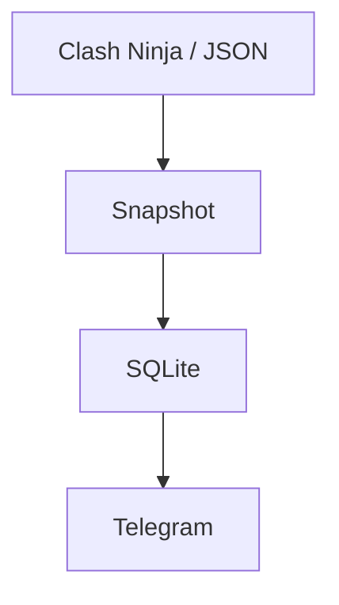

# Clash Ninja Telegram Notifier

[Русский](README.md) · [English](README_EN.md)

Telegram bot for Clash of Clans upgrade timers and completion notifications across villages. Uses Clash Ninja or local game JSON exports.

## Requirements

- Windows;
- Python **3.14+**;
- a Clash Ninja account with Upgrade Tracker configured;
- a Telegram bot created through [@BotFather](https://t.me/BotFather).

The supported launcher is [start.bat](start.bat). When the Windows Python Launcher is present, it invokes the exact `py -3.14` selector; having only a newer Python version installed does not guarantee that `.venv` can be created. Other operating systems are not supported by the current release.

## Quick start

1. Clone the repository or download the [ZIP archive](https://github.com/soroka01/Clash-Of-Clans-Telegram-Clash-Ninja-notifyer/archive/refs/heads/main.zip).
2. Copy [config.example.json](config.example.json) to `config.json`.
3. Set the Telegram token, allowed user IDs, and notification chats.
4. Choose the data source: `"data_source": "clash_ninja"` for the website or `"data_source": "json"` for local game exports.
5. Run:

   ```powershell
   .\start.bat
   ```

6. Send `/start` to the bot.

The launcher creates a local `.venv`, upgrades `pip`, `setuptools`, and `wheel` inside it, installs `requirements.txt`, and starts `main.py`. It does not use global Python packages.

Manual launch after the environment has been prepared:

```powershell
.\.venv\Scripts\python.exe main.py
```

## How it works



## Commands

| Command | Action |
| --- | --- |
| `/start` | Open the main menu |
| `/menu` | Open the main menu |
| `/status` | Open the all-account dashboard directly |

The menu provides current upgrades, account selection, UTC settings, Clash Ninja, Clash of Clans, and GitHub links.

## Configuration

```json
{
  "bot_token": "PUT_TELEGRAM_BOT_TOKEN_HERE",
  "authorized_user_ids": [123456789],
  "notification_chat_ids": [123456789],
  "poll_interval_seconds": 60,
  "dashboard_refresh_seconds": 10,
  "utc_offset_hours": 5,
  "database_path": "data/clash_ninja_bot.sqlite3",
  "data_source": "json",
  "json_accounts_directory": "accounts",
  "clash_ninja": {
    "tracker_url": "https://www.clash.ninja/upgrade-tracker",
    "cookie_header": "PUT_FULL_COOKIE_HEADER_FROM_LOGGED_IN_CLASH_NINJA_HERE",
    "request_timeout_seconds": 30
  }
}
```

| Field | Purpose |
| --- | --- |
| `bot_token` | Telegram bot token |
| `authorized_user_ids` | User IDs allowed to use commands and buttons |
| `notification_chat_ids` | Private chats or groups that receive alerts |
| `poll_interval_seconds` | Network refresh period; minimum 30 seconds |
| `dashboard_refresh_seconds` | Countdown redraw period; minimum 10 seconds |
| `utc_offset_hours` | Default UTC offset, an integer from `-12` through `14` |
| `database_path` | Local SQLite database path |
| `data_source` | `clash_ninja` or `json` |
| `json_accounts_directory` | Folder containing account JSON files |
| `clash_ninja.tracker_url` | Upgrade Tracker URL |
| `clash_ninja.cookie_header` | Complete HTTP `Cookie` header value |
| `clash_ninja.request_timeout_seconds` | Request timeout; minimum 5 seconds |

> [!WARNING]
> An empty `authorized_user_ids` list allows any Telegram user who finds the bot to use its menu. Always configure at least your own numeric user ID for a private installation.

## Getting the Clash Ninja cookie

1. Sign in to Clash Ninja and open [Upgrade Tracker](https://www.clash.ninja/upgrade-tracker).
2. Press `F12`, open **Network**, and reload the page.
3. Select the successful `upgrade-tracker` request.
4. Open **Headers** → **Request Headers**.
5. Copy the complete value after `Cookie:` as one line.
6. Paste it into `clash_ninja.cookie_header`.

Cookies expire. If the log says Clash Ninja rejected the session, sign in again and replace the value.

## Local data and security

| Path | Contents |
| --- | --- |
| `config.json` | Telegram token and Clash Ninja cookie; excluded from Git |
| `data/clash_ninja_bot.sqlite3` | Last snapshot, dashboard messages, and timezones |
| `logs/bot.log` | Detailed rotating log |
| `logs/error.log` | Errors only |

Do not publish these files. Keep `config.json` and `data/` when moving an installation if you want to preserve settings and saved screens.

## Automatic updates

`start.bat` checks for updates before launch:

- a Git clone uses `git fetch` followed by `git pull --ff-only`;
- any output from `git status --porcelain`, including untracked files, skips the update;
- without Git, or from an extracted ZIP, the launcher downloads a fresh archive through PowerShell;
- when the network update fails, the installed version still starts.

Both paths preserve `config.json`, `.venv`, `data/`, and `logs/`. ZIP mode may replace every other project file, so do not keep uncommitted source edits in that directory.

## Limitations

- The parser depends on Clash Ninja's current HTML and feed structure and may need updates when the site changes.

## Troubleshooting

| Symptom | Check |
| --- | --- |
| Clash Ninja rejects the session | Obtain a new `cookie_header` |
| The bot ignores commands | `bot_token` and your ID in `authorized_user_ids` |
| No alerts arrive | `notification_chat_ids`, bot permissions, and `logs/error.log` |
| The dashboard is stale | Clash Ninja availability and `poll_interval_seconds` |
| The update is skipped | `git status --short`, including untracked files |
| `.venv` is not created | Python 3.14 is available for `py -3.14` |

## JSON mode without Clash Ninja

The bot can read the game's JSON exports directly. Set this in `config.json`:

```json
{
  "data_source": "json",
  "json_accounts_directory": "accounts"
}
```

Put one original JSON export per village in `accounts/`. No fields need to be added: the account name is the filename without `.json`, for example `accounts/Greatness.json`. Builder Base fields (`buildings2`, `units2`, and other `2`-suffix fields) are ignored.

Cookie and website access are not required in this mode. When you replace an account JSON file, the bot detects completed active timers on the next polling cycle.

## License

[MIT](LICENSE).

## Support

Feel free to [fork this repository](https://github.com/soroka01/Clash-Of-Clans-Telegram-Clash-Ninja-notifyer/fork) and adapt it. If it helped you, leave a [Star](https://github.com/soroka01/Clash-Of-Clans-Telegram-Clash-Ninja-notifyer) so I can see it was useful.

---

with love ❤️
