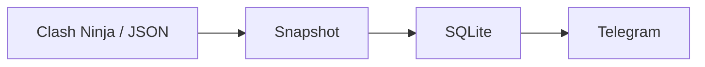

# ⚔️ Clash Ninja Telegram Notifier

> Telegram bot for Clash of Clans upgrade timers and completion notifications across villages.

🌐 **Язык / Language:** [Русский](README.md) · [English](README_EN.md)


## 📌 Overview

The bot tracks upgrade timers for several Clash of Clans accounts (villages), shows them in a Telegram dashboard with a refreshing countdown, and sends a notification when an upgrade completes. Data comes from the Clash Ninja Upgrade Tracker or from local game JSON exports.

> [!WARNING]
> An empty `authorized_user_ids` list allows any Telegram user who finds the bot to use its menu. Always configure at least your own numeric user ID for a private installation.

> [!NOTE]
> Only Windows and launching through [start.bat](start.bat) are supported. Builder Base is not tracked.

## ✨ Features

- Upgrade timers per village and a dashboard for all accounts with a refreshing countdown.
- Completion notifications to private chats or groups.
- Two data sources: Clash Ninja (cookie) or local game JSON exports.
- Timezone (UTC) setting from the bot menu.
- State (snapshot, dashboard messages, timezone) is stored in a local SQLite database.
- `start.bat` creates `.venv`, installs dependencies, and checks for updates by itself.

## 🏗️ How it works


```mermaid
flowchart LR
    A["Clash Ninja / JSON"] --> B["Snapshot"]
    B --> C["SQLite"]
    C --> D["Telegram"]
```

The bot fetches data periodically (`poll_interval_seconds`) and stores a snapshot; the dashboard countdown is redrawn every `dashboard_refresh_seconds`.

## 🚀 Quick start

### Requirements

- Windows;
- Python **3.14+** (with the Windows Python Launcher present, `start.bat` invokes `py -3.14`; having only a newer Python installed does not guarantee `.venv` can be created);
- a Telegram bot created through [@BotFather](https://t.me/BotFather);
- for the Clash Ninja source: an account with Upgrade Tracker configured.

### Installation

```powershell
git clone https://github.com/soroka01/Clash-Of-Clans-Telegram-Clash-Ninja-notifyer.git
cd Clash-Of-Clans-Telegram-Clash-Ninja-notifyer
```

Or download the [ZIP archive](https://github.com/soroka01/Clash-Of-Clans-Telegram-Clash-Ninja-notifyer/archive/refs/heads/main.zip).

### Configuration

```powershell
Copy-Item config.example.json config.json
```

In `config.json` set the Telegram token, allowed user IDs, notification chats, and `data_source` (`clash_ninja` or `json`). All fields are described below.

### Run

```powershell
.\start.bat
```

Then send `/start` to the bot. The launcher creates a local `.venv`, upgrades `pip`, `setuptools`, and `wheel` inside it, installs `requirements.txt`, and starts `main.py`; global Python packages are not used. Manual launch after the environment is prepared:

```powershell
.\.venv\Scripts\python.exe main.py
```

## ⚙️ Configuration

Settings are read from `config.json` (template: [config.example.json](config.example.json)).

```json
{
  "bot_token": "PUT_TELEGRAM_BOT_TOKEN_HERE",
  "authorized_user_ids": [123456789],
  "notification_chat_ids": [123456789],
  "poll_interval_seconds": 60,
  "dashboard_refresh_seconds": 10,
  "utc_offset_hours": 5,
  "database_path": "data/clash_ninja_bot.sqlite3",
  "data_source": "json",
  "json_accounts_directory": "accounts",
  "clash_ninja": {
    "tracker_url": "https://www.clash.ninja/upgrade-tracker",
    "cookie_header": "PUT_FULL_COOKIE_HEADER_FROM_LOGGED_IN_CLASH_NINJA_HERE",
    "request_timeout_seconds": 30
  }
}
```

| Variable | Default | Description |
| --- | --- | --- |
| `bot_token` | required | Telegram bot token |
| `authorized_user_ids` | required | User IDs allowed to use commands and buttons |
| `notification_chat_ids` | required | Private chats or groups that receive alerts |
| `poll_interval_seconds` | `60` | Network refresh period; minimum 30 |
| `dashboard_refresh_seconds` | `10` | Countdown redraw period; minimum 10 |
| `utc_offset_hours` | `0` | Default UTC offset, an integer from `-12` through `14` |
| `database_path` | `data/clash_ninja_bot.sqlite3` | Local SQLite database path |
| `data_source` | `clash_ninja` | `clash_ninja` or `json` |
| `json_accounts_directory` | `accounts` | Folder containing account JSON files |
| `clash_ninja.tracker_url` | `https://www.clash.ninja/upgrade-tracker` | Upgrade Tracker URL |
| `clash_ninja.cookie_header` | none | Complete HTTP `Cookie` header value |
| `clash_ninja.request_timeout_seconds` | `30` | Request timeout; minimum 5 |

### Commands

| Command | Description |
| --- | --- |
| `/start` | Open the main menu |
| `/menu` | Open the main menu |
| `/status` | Open the all-account dashboard directly |

The menu provides current upgrades, account selection, UTC settings, and Clash Ninja, Clash of Clans, and GitHub links.

### Clash Ninja source: cookie

1. Sign in to Clash Ninja and open [Upgrade Tracker](https://www.clash.ninja/upgrade-tracker).
2. Press `F12`, open **Network**, and reload the page.
3. Select the successful `upgrade-tracker` request.
4. Under **Headers** → **Request Headers**, copy the complete value after `Cookie:` as one line.
5. Paste it into `clash_ninja.cookie_header`.

If `cookie_header` is empty or still contains the `PUT_...` placeholder, the bot tries to find the cookie in a browser where you are signed in to Clash Ninja (AppData, Windows only); if the browser is open, close it and restart. Cookies expire: if the log says Clash Ninja rejected the session, sign in again and replace the value.

### JSON source (without Clash Ninja)

```json
{
  "data_source": "json",
  "json_accounts_directory": "accounts"
}
```

Put one original JSON export per village in `accounts/`. Nothing needs to be added: the account name is the filename without `.json`, for example `accounts/Greatness.json`. Builder Base fields (`buildings2`, `units2`, and other `2`-suffix fields) are ignored. Cookie and website access are not required in this mode; when you replace an account JSON file, the bot detects completed active timers on the next polling cycle.

### Automatic updates

`start.bat` checks for updates before launch:

- in a Git clone: `git fetch` followed by `git pull --ff-only`;
- any output from `git status --porcelain`, including untracked files, skips the update;
- without Git, or from an extracted ZIP, the launcher downloads a fresh archive through PowerShell;
- when the network update fails, the installed version still starts.

`config.json`, `.venv`, `data/`, and `logs/` are preserved. ZIP mode may replace every other project file, so do not keep uncommitted edits in that directory.

### Troubleshooting

| Symptom | Check |
| --- | --- |
| Clash Ninja rejects the session | Obtain a new `cookie_header` |
| The bot ignores commands | `bot_token` and your ID in `authorized_user_ids` |
| No alerts arrive | `notification_chat_ids`, bot permissions, and `logs/error.log` |
| The dashboard is stale | Clash Ninja availability and `poll_interval_seconds` |
| The update is skipped | `git status --short`, including untracked files |
| `.venv` is not created | Python 3.14 is available for `py -3.14` |

## 🗂️ Project structure

```text
.
├── main.py                 # entry point, logging, bot startup
├── start.bat               # launcher: update, .venv, dependencies, run
├── requirements.txt        # aiogram, aiohttp, beautifulsoup4, cryptography
├── config.example.json     # settings template
├── accounts/               # game JSON exports (local, not in Git)
├── data/                   # SQLite database (local, not in Git)
├── logs/                   # bot.log, error.log (local, not in Git)
└── app/
    ├── config.py           # loading and validating config.json
    ├── models.py           # data models
    ├── monitor.py          # source polling and completion detection
    ├── storage.py          # SQLite
    ├── presentation.py     # message and dashboard formatting
    ├── telegram_ui.py      # commands, menu, buttons
    ├── timefmt.py          # time formatting
    └── clash_ninja/        # client, parser, cookies, JSON source, game data
```

## 🔒 Security & privacy

| Path | Contents |
| --- | --- |
| `config.json` | Telegram token and Clash Ninja cookie; excluded from Git |
| `accounts/*.json` | Game exports; excluded from Git |
| `data/clash_ninja_bot.sqlite3` | Last snapshot, dashboard messages, and timezones |
| `logs/bot.log` | Detailed rotating log |
| `logs/error.log` | Errors only |

Do not publish these files. Keep `config.json` and `data/` when moving an installation to preserve settings and saved screens.

## ⚠️ Limitations

- The parser depends on Clash Ninja's current HTML and feed structure and may need updates when the site changes.
- Only Windows is supported.
- Builder Base is not tracked.

## 📄 License

[MIT](LICENSE).

## 💬 Support

Feel free to [fork this repository](https://github.com/soroka01/Clash-Of-Clans-Telegram-Clash-Ninja-notifyer/fork) and adapt it. If it helped you, leave a [Star](https://github.com/soroka01/Clash-Of-Clans-Telegram-Clash-Ninja-notifyer) so I can see it was useful.

---

with love ❤️
